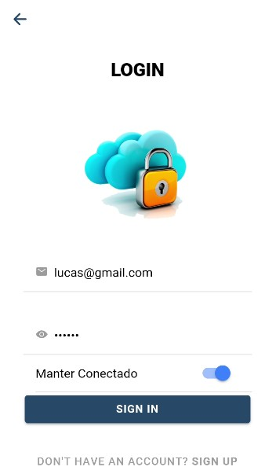

# Five contacts (Ionic)
> Work for the discipline of Programming for mobile devices

## PERGUNTAS

● O seu protótipo é descartável ou evolucionário? Justifique.
     Descartável pois o protótipo foi apenas para ajudar a levantar os requisitos e não será refinado.
  
● Quais as características da linguagem escolhida fazem ela apropriada para o
desenvolvimento de um protótipo?
  Fiz utilizando o ionic, com typescript. Foi apropriada pois o protótipo era mobile, então atendia todos os requisitos.
  
● Que dificuldades você teve no desenvolvimento do protótipo?
  Algumas telas desenvolvidas, como a de como fazer a ligação e favoritar.
  
● Quais as vantagens de ter um protótipo desenvolvido antes da implementação do
programa efetivo?
  A vantagem é não ter que ficar pensando em mais uma coisa que é o layout na hora da implementação.





## Development setup


```sh
npm install
ionic serve 
or to run in device
ionic cordova run android
```

